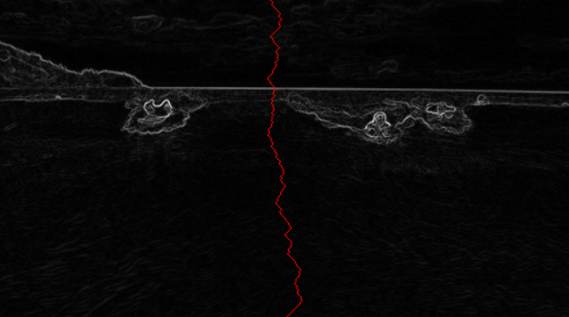
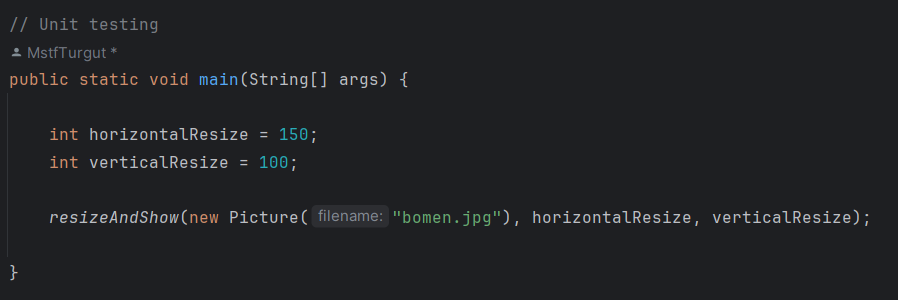

# Seam Carving

Seam-carving is a content-aware image resizing technique where the image is reduced in size by one pixel of height (or width) at a time. A vertical seam in an image is a path of pixels connected from the top to the bottom with one pixel in each row; a horizontal seam is a path of pixels connected from the left to the right with one pixel in each column. Below left is the original 505-by-287 pixel image; below right is the result after removing 150 vertical seams, resulting in a 30% narrower image. Unlike standard content-agnostic resizing techniques (such as cropping and scaling), seam carving preserves the most interest features (aspect ratio, set of objects present, etc.) of the image.

 

## Energy Calculation

 The first step is to calculate the energy of each pixel, which is a measure of the importance of each pixel—the higher the energy, the less likely that the pixel will be included as part of a seam. In this project, we implement the dual-gradient energy function, which is described below. Here is the dual-gradient energy function of the surfing image above:
 
 
 
 
 The energy is high (white) for pixels in the image where there is a rapid color gradient (such as the boundary between the sea and sky). The seam-carving technique avoids removing such high-energy pixels.
 
### Computing the energy of a pixel with dual-gradient function
 
 The energy of pixel (x,y) is √[Δx^2(x,y)+Δy^2(x,y)], where the square of the x-gradient Δx^2(x,y)=Rx(x,y)^2+Gx(x,y)^2+Bx(x,y)^2, and where the central differences Rx(x,y), Gx(x,y) and Bx(x,y) are the differences in the red, green, and blue components between pixel (x + 1, y) and pixel (x − 1, y), respectively. We define the energy of a pixel at the border of the image to be 1000, so that it is strictly larger than the energy of any interior pixel.
 
As an example, let's consider a 3-by-4 image with RGB values—each component is an integer between 0 and 255—as shown in the table below:

The ten border pixels have energy 1000. Only the pixels (1, 1) and (1, 2) are nontrivial. We calculate the energy of pixel (1, 2) in detail:

Rx(1, 2) = 255 − 255 = 0,  
Gx(1, 2) = 205 − 203 = 2,  
Bx(1, 2) = 255 − 51 = 204,  
yielding Δx^2(1, 2) = 2^2 + 204^2 = 41620.

Ry(1, 2) = 255 − 255 = 0,  
Gy(1, 2) = 255 − 153 = 102,  
By(1, 2) = 153 − 153 = 0,  
yielding Δy^2(1, 2) = 102^2 = 10404.

Thus, the energy of pixel (1, 2) is √(41620+10404) = √52024. Similarly, the energy of pixel (1, 1) is √[(204)^2+(103)^2] = √52225.
 
  
 
## Seam Identification
 
 The next step is to find a vertical seam of minimum total energy. This is similar to the classic shortest path problem in an edge-weighted digraph except for the following:
 
* The weights are on the vertices instead of the edges.

* We want to find the shortest path from any of the W pixels in the top row to any of the W pixels in the bottom row.

* The digraph is acyclic, where there is a downward edge from pixel (x, y) to pixels (x − 1, y + 1), (x, y + 1), and (x + 1, y + 1), assuming that the coordinates are in the prescribed range.
 

 

### Finding a vertical seam

The `findVerticalSeam()` method returns an array of length H such that entry y is the column number of the pixel to be removed from row y of the image. For example, the dual-gradient energies of a 6-by-5 image

The minimum energy vertical seam is highlighted in blue. In this case, the method `findVerticalSeam()` returns the array { 3, 4, 3, 2, 2 } because the pixels in a minimum energy vertical seam are (3, 0), (4, 1), (3, 2), (2, 3), and (2, 4).

### Finding a Horizontal seam

The behavior of `findHorizontalSeam()` is analogous to that of `findVerticalSeam()` except that it returns an array of length width such that entry x is the row number of the pixel to be removed from column x of the image. For the 6-by-5 image, the method `findHorizontalSeam()` returns the array { 2, 2, 1, 2, 1, 2 } because the pixels in a minimum energy horizontal seam are (0, 2), (1, 2), (2, 1), (3, 2), (4, 1), and (5, 2).

 

## Seam Removal

The final step is to remove from the image all of the pixels along the seam.

 

## Testing

Now let's test the algorithm and see how the code resizes an image with respect to its content. 

Here is our image before resizing; 

And testing code;

After running the code above, the program shows the resized image;

As we can see, our program successfully managed to resize the given image efficiently without losing any content.

 
 

Mustafa Turgut   
mstftrgt00@gmail.com

